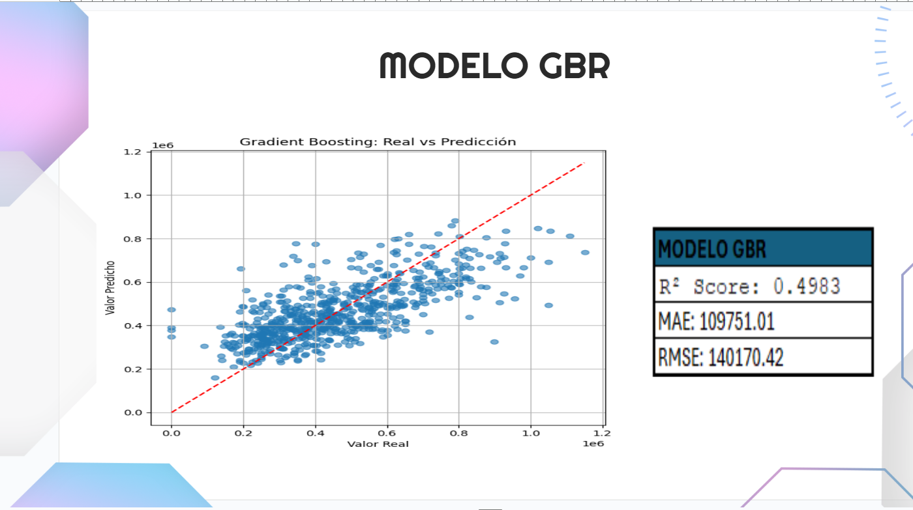

# Predicción de Precios de Casas con Aprendizaje Automático

## Autores

- **Wellington Cortes Álvarez**
- **Fabio Alejandro Sastoque Rincón**

---

## Descripción del Proyecto

Este proyecto es una aplicación de técnicas de aprendizaje automático para la predicción de precios de casas, desarrollado como parte de la Maestría en Inteligencia Artificial y Ciencia de datos de la Universidad Autónoma de Occidente. El objetivo principal es analizar un conjunto de datos inmobiliarios, realizar un proceso completo de análisis y limpieza, y construir modelos predictivos que permitan estimar el valor de una vivienda a partir de sus características.

---

## Estructura del Proyecto

- `Final.ipynb`: Notebook principal con todo el flujo de trabajo, desde la carga de datos hasta la evaluación de modelos.
- `data_hause.csv`: Archivo de datos utilizado para el análisis y entrenamiento de los modelos.
- `requirements.txt`: Lista de dependencias necesarias para ejecutar el proyecto.
- `.gitignore`: Archivos y carpetas ignorados por git.
- `README.md`: Docuementación del proyecto.

---

## Flujo de Trabajo

### 1. **Carga y Exploración de Datos**
   - Se utiliza `pandas` para cargar el archivo `data_hause.csv`.
   - Se realiza una inspección inicial de los datos, visualizando las primeras filas y revisando los tipos de variables y la existencia de valores nulos.

### 2. **Preprocesamiento y Limpieza**
   - Conversión de fechas y renombramiento de columnas para facilitar el análisis.
   - Análisis descriptivo de las variables numéricas.
   - Visualización de la distribución de variables y detección de valores atípicos (outliers).
   - Eliminación de outliers utilizando el rango intercuartílico (IQR).
   - Eliminación de columnas irrelevantes para el modelo.

### 3. **Análisis Exploratorio de Datos**
   - Visualización de correlaciones entre variables mediante mapas de calor.
   - Gráficas de dispersión y boxplots para entender la relación entre variables y el precio.

### 4. **Preparación de Datos para Modelado**
   - Separación de variables predictoras (`X`) y variable objetivo (`y`).
   - División del conjunto de datos en entrenamiento y prueba.

### 5. **Modelado Predictivo**
   - **Random Forest Regressor:** Entrenamiento y evaluación de un modelo de bosque aleatorio.
   - **Regresión Lineal:** Entrenamiento y evaluación de un modelo de regresión lineal.
   - **Gradient Boosting Regressor:** Entrenamiento y evaluación de un modelo de boosting por gradiente.

### 6. **Evaluación de Modelos**
   - Se utilizan métricas como R², MAE y RMSE para comparar el desempeño de los modelos.
   - Visualización de resultados y comparación entre valores reales y predichos.

### 7. **Predicción con Nuevos Datos**
   - Se realizan predicciones con datos de ejemplo para validar la utilidad de los modelos entrenados.

---

## Requisitos

Para ejecutar este proyecto, asegúrate de tener instalado Python 3.11+ y las siguientes librerías:

- pandas
- numpy
- matplotlib
- seaborn
- scikit-learn

Puedes instalar todas las dependencias ejecutando:

```sh
pip install -r requirements.txt
```

---

## Ejecución

1. Clona este repositorio.
2. Instala las dependencias.
3. Abre el archivo [Final.ipynb](Final.ipynb) en Jupyter Notebook o Visual Studio Code.
4. Ejecuta las celdas secuencialmente para reproducir el análisis y los resultados.

## Resultados

El proyecto demuestra cómo diferentes modelos de aprendizaje automático pueden ser aplicados para predecir precios de casas, mostrando sus ventajas y limitaciones. Se incluyen visualizaciones y métricas para facilitar la interpretación de los resultados.

A continuación, se presentan los resultados obtenidos para cada modelo:

**Random Forest**
- R² Score: 42%
- MAE: $117,312.37
- RMSE: $151,768.52


**Regresión Lineal**
- R² Score: 46%
- MAE: $114,630.81
- RMSE: $145,485.87


**Gradient Boosting Regressor (GBR)**
- R² Score: 50%
- MAE: $109,751.01
- RMSE: $140,170.42



**Comparación de Modelos**

La siguiente tabla y gráfica resumen el desempeño de los modelos evaluados:


| Modelo             | R² Score | MAE         | RMSE        |
|--------------------|---------:|------------:|------------:|
| **GBR**            |    50%   | $109,751.01 | $140,170.42 |
| Regresión Lineal   |    46%   | $114,630.81 | $145,485.87 |
| Random Forest      |    42%   | $117,312.37 | $151,768.52 |

---

## Conclusiones

- El tratamiento de outliers y la selección adecuada de variables influyeron positivamente en la calidad de los modelos predictivos.
- El análisis exploratorio permitió identificar relaciones significativas entre las características físicas de las viviendas y su precio, lo que facilitó la construcción de modelos más robustos.
- El modelo más efectivo fue el **Gradient Boosting Regressor (GBR)**, alcanzando un R² del 50%, un MAE de $109,751.01 y un RMSE de $140,170.42, superando a la regresión lineal y al random forest.
- A pesar de las mejoras, el desempeño general sugiere que existen variables relevantes no representadas en el dataset, por lo que futuras iteraciones podrían beneficiarse de la inclusión de información adicional o de técnicas de ingeniería de características más avanzadas.
- El proyecto evidencia la importancia del preprocesamiento y la exploración de datos en el desarrollo de modelos de aprendizaje automático aplicados a problemas reales.

---

## Anexos

1. Avance 1 proyecto: https://drive.google.com/file/d/1rH7yOpio2VBpnKKzhcJXfUFnBLyhzcS_/view?usp=sharing
2. Presentación Final Proyecto: https://docs.google.com/presentation/d/1KIuFm-eZzntik0vkU8siCSWr4W_sW7-N/edit?usp=sharing&ouid=109200381175192477660&rtpof=true&sd=true
3. Articulo entrega Final: https://drive.google.com/file/d/1Efkkxnhtg4AsvIfBMkWftPbwLqQPgzIa/view?usp=sharing
4. Link del Repositorio de Github: https://github.com/fasastoqueUAO/project_ml.git